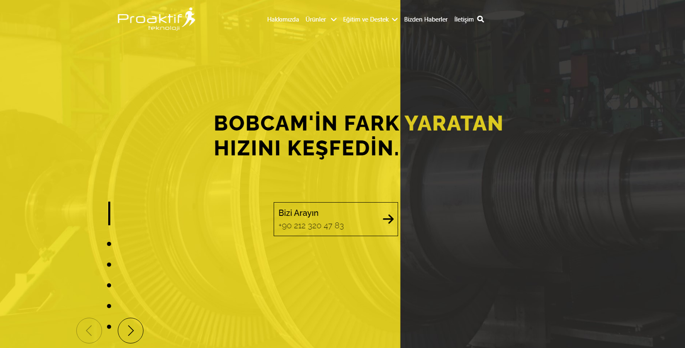

# Freelancer Homepage



Bu proje, Proaktif Şirketi'nin potansiyel müşterilerine daha iyi hizmet verebilmek 
amacıyla oluşturduğu bir web sayfasını temsil eder. Bu projede, sayfanın responsive
ve kod hatalarını düzelterek web sitesinin performansını artırmayı hedefledim
ve frontend becerilerimi daha da geliştirmeyi amaçladım.

## Özellikler

- Temiz ve basit tasarım
- Görsel odaklı portföy sayfası
- İletişim formu
- Mobil uyumlu (responsive) tasarım
- İyi yapılandırılmış ve anlaşılır HTML ve CSS kodları


## Geliştirme Aşamaları

1. Proje ihtiyaçlarının belirlenmesi ve tasarım oluşturulması
2. HTML yapısının oluşturulması
3. CSS stillemelerinin eklenmesi
4. Responsive tasarımın uygulanması
5. Kod hatalarının ve responsive hatalarının düzeltilmesi

## Nasıl Kullanılır

1. Projeyi klonlayın:

   ```bash
   git clone https://github.com/emirtetik/freelancer-homepage.git
